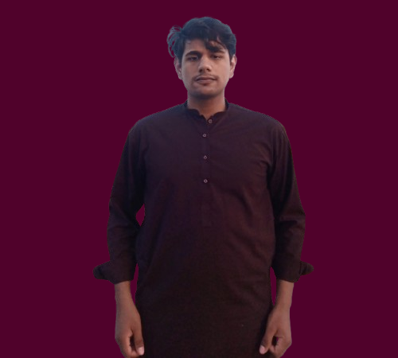

<div align="center">
  

  # 🚀 Ahmad Hassan — Portfolio

  <p><b>AI Engineer • Full-Stack Developer</b></p>
  
  <p><i>Building intelligent systems, not just interfaces.</i></p>

  <p>
    <a href="https://github.com/thisisahmad24"></a>
    <a href="https://www.linkedin.com/in/ahmad-hassan-ai-engineer"></a>
    <a href="mailto:thisisahmad07@gmail.com"></a>
  </p>
</div>

<br />

## 🧠 About Me

I design and build intelligent, production-ready systems that combine AI with real-world applications.

My focus is on creating the **“brain layer”** of modern software — from Agentic AI workflows and LLM-powered applications to scalable backend systems — while still delivering clean, intuitive user experiences. Unlike traditional developers, I don’t just build features; I build decision-making systems.

---

## 💻 Tech Stack & Expertise

<table align="center">
  <tr>
    <td align="center" width="96">
      
      <br>Python
    </td>
    <td align="center" width="96">
      
      <br>TensorFlow
    </td>
    <td align="center" width="96">
      
      <br>React
    </td>
    <td align="center" width="96">
      
      <br>TypeScript
    </td>
    <td align="center" width="96">
      
      <br>Node.js
    </td>
    <td align="center" width="96">
      
      <br>MongoDB
    </td>
  </tr>
</table>

### 🎯 Key Competencies
- **Agentic AI & ML Workflows**: Developing intelligent workflows using large language models and computer vision platforms.
- **Backend Architecture**: Engineering robust reasoning layers with Python, FastAPI, and robust SQL/NoSQL datastores.
- **Full-Stack Wizardry**: Crafting sleek, responsive interfaces with React, Next.js, and Tailwind CSS.
  
---

## 🚀 Projects Overview

Here is a glimpse of what I am currently working on:

> **[VIRQA — AI-Powered Interview & Assessment Platform](#)**
> *AI-driven candidate evaluation system with structured workflows. Focused on AI-powered hiring systems. In active development.*

> **Agentic AI System (Multi-Agent Workflows)**
> *In progress autonomous AI task execution environment powered by interconnected LLM agents & FastAPI.*

> **AI Video Intelligence**
> *In progress computer vision pipeline ensuring real-time video comprehension while safeguarding data privacy using TensorFlow.*

---

## 🛠️ Quick Start (Running Locally)

To run this portfolio locally:

1. **Clone the repository:**
   ```bash
   git clone https://github.com/thisisahmad24/portfolio.git
   cd portfolio
   ```

2. **Install dependencies:**
   ```bash
   npm install
   ```

3. **Start the development server:**
   ```bash
   npm run dev
   ```

4. **Open in browser:** Navigate to `http://localhost:5173/` (or the port specified by Vite).

---

## 📬 Contact

<p>
  Available for remote work, collaborations, and new opportunities as an AI / Full-Stack Engineer.<br/>
  🌍 Based in: <b>Lahore, Pakistan</b>
</p>

### Drop a Message: 
📧 **[thisisahmad07@gmail.com](mailto:thisisahmad07@gmail.com)** | 📱 **0311-4512268** <br />
🔗 **[LinkedIn](https://www.linkedin.com/in/ahmad-hassan-ai-engineer)** | 🐙 **[GitHub](https://github.com/thisisahmad24)**

---
<div align="center">
  <p><i>“I don’t just write code — I design systems that think, adapt, and solve real problems.”</i></p>
  
</div>
